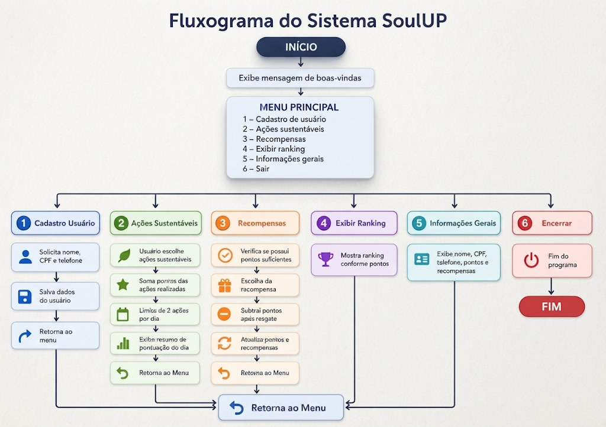

# 🎮 SoulUP - Sprint 3 e 4

Continuação do projeto **SoulUP**, desenvolvido para a disciplina de **Front-End** da **FIAP**, com foco na criação de uma solução de gamificação para incentivar produtividade, organização e engajamento dos usuários dentro da plataforma.

Nesta etapa (Sprints 3 e 4), o projeto evoluiu do protótipo estático em HTML/CSS/JS para uma aplicação **React + TypeScript**, migrando toda a solução para o diretório [`soulup-gamificacao`](./soulup-gamificacao).

---

## 📌 Sobre o Projeto

A proposta da SoulUP é utilizar elementos de gamificação para tornar a experiência do usuário mais dinâmica, interativa e motivadora.

A plataforma oferece recursos que incentivam o desenvolvimento pessoal e profissional através de:
- metas personalizadas;
- desafios diários;
- sistema de pontuação;
- ranking de usuários;
- recompensas por desempenho.

---

## 🚀 Tecnologias Utilizadas

- React
- TypeScript
- Vite
- Tailwind CSS
- React Router DOM
- React Hook Form
- ESLint

---

## 📂 Estrutura do Projeto

```bash
📁 sprint-3-4
┗ 📂 soulup-gamificacao
  ┣ 📂 public
  ┣ 📂 src
  ┃ ┣ 📂 assets
  ┃ ┃ ┗ 📂 imagens
  ┃ ┣ 📂 components
  ┃ ┃ ┣ 📂 Button
  ┃ ┃ ┣ 📂 Card
  ┃ ┃ ┣ 📂 Footer
  ┃ ┃ ┣ 📂 Header
  ┃ ┃ ┣ 📂 MainLayout
  ┃ ┃ ┗ 📂 SectionTitle
  ┃ ┣ 📂 pages
  ┃ ┃ ┣ 📂 Home
  ┃ ┃ ┣ 📂 Sobre
  ┃ ┃ ┣ 📂 Integrantes
  ┃ ┃ ┣ 📂 FAQ
  ┃ ┃ ┣ 📂 Contato
  ┃ ┃ ┣ 📂 Solucao
  ┃ ┃ ┣ 📂 SolucaoDetalhe
  ┃ ┃ ┣ 📂 Login
  ┃ ┃ ┗ 📂 Cadastro
  ┃ ┣ 📄 App.tsx
  ┃ ┣ 📄 main.tsx
  ┃ ┗ 📄 index.css
  ┣ 📄 index.html
  ┣ 📄 package.json
  ┗ 📄 vite.config.ts
```

---

## ✨ Funcionalidades

- 🏠 Página inicial
- 🎮 Página de solução (com detalhe dinâmico por rota `/solucao/:id`)
- ℹ️ Página sobre
- 👥 Página de integrantes
- 📞 Página de contato
- ❓ FAQ (Perguntas Frequentes)
- 🔐 Cadastro/Login
- 📱 Layout responsivo com componentes reutilizáveis (Header, Footer, Card, Button)

---

## ▶️ Como Executar o Projeto

1. Clone este repositório:

```bash
git clone https://github.com/AndrewRls/sprint-3-4.git
```

2. Acesse a pasta do projeto React:

```bash
cd sprint-3-4/soulup-gamificacao
```

3. Instale as dependências:

```bash
npm install
```

4. Rode o projeto em ambiente de desenvolvimento:

```bash
npm run dev
```

5. Acesse no navegador o endereço exibido no terminal (por padrão `http://localhost:5173`).

---
## 💯🚀 Imagem representativa da solução (Fluxograma)



---

## 👨‍💻 Integrantes

- **Andrew Rodrigues Lima da Silva** - RM 573777  
- **Bryan Costa Silva** - RM 569439  
- **Luis Henrique Rondão Mendonça** - RM 569797  
- **Igor Blacconaro Santos** - RM 572033  

---

## 🔗 GitHub dos Integrantes

- Andrew: https://github.com/AndrewRls  
- Bryan: https://github.com/BryanC0staDev  
- Luis Henrique: https://github.com/luishdev0  
- Igor: https://github.com/igorblacconaro  

---

## 🎓 Instituição

Projeto acadêmico desenvolvido para:

**FIAP**  
Disciplina: **Front-End**  
Sprint Challenge - Sprints 3 e 4

---

## 📝 Licença

Projeto desenvolvido para fins acadêmicos.